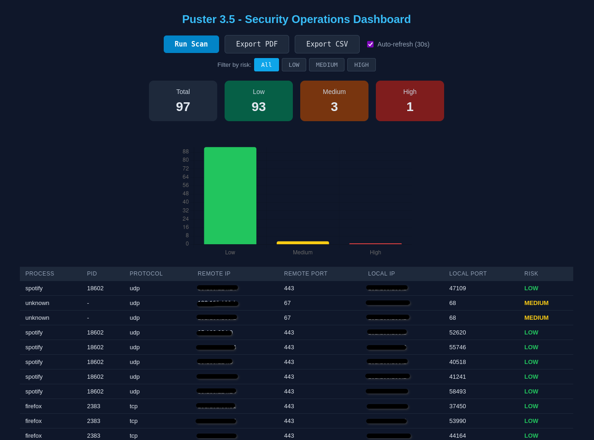
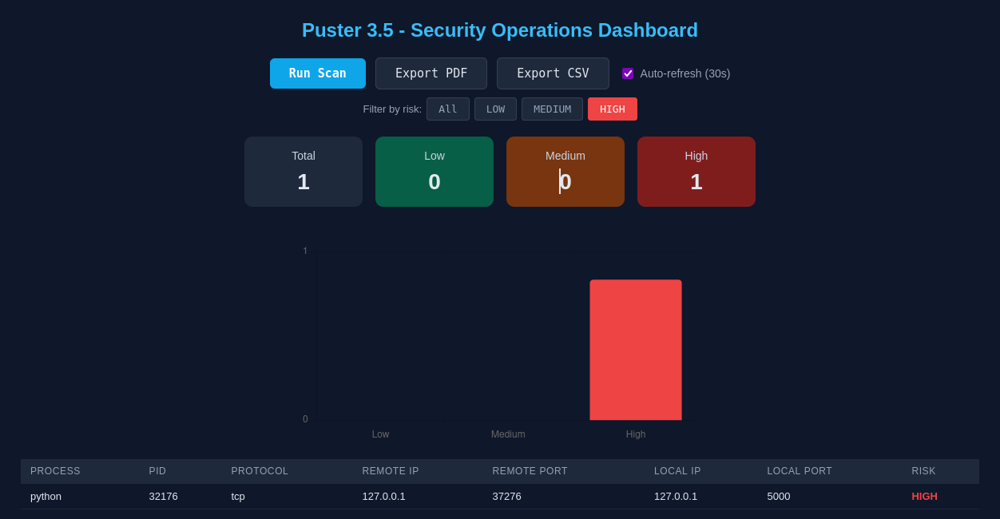

# Puster 3.5 - Security Operations Dashboard

Security monitoring dashboard that scans active network connections, classifies risk levels, and generates PDF/CSV reports.

## Architecture

- **puster.c** - Scans TCP/UDP connections using `ss`, classifies risk (LOW/MEDIUM/HIGH), generates JSON
- **app.py** - Flask server that executes the binary and serves the web dashboard
- **HTML/JS/CSS** - Dashboard with Chart.js, filters, interactive table, and auto-refresh

## Requirements

- Python 3.10+
- GCC
- `ss` (iproute2, included in Linux)

## Installation

```bash
# Clone the repository
git clone https://github.com/oramirez13/puster_flask.git
cd puster_flask

# Set up Python environment
python3 -m venv .venv
.venv/bin/pip install -r requirements.txt

# Compile the C binary
make
```

### If make fails

You can compile manually:
```bash
gcc -o puster puster.c
```

## Usage

```bash
.venv/bin/python app.py
```

Open http://127.0.0.1:5000

### Environment Variables

| Variable       | Default   | Description           |
| -------------- | --------- | --------------------- |
| `PUSTER_PORT`  | 5000      | Server port           |
| `PUSTER_HOST`  | 127.0.0.1 | Server listen address |
| `PUSTER_DEBUG` | false     | Flask debug mode      |

## Endpoints

| Route                                     | Description            |
| ----------------------------------------- | ---------------------- |
| `GET /`                                   | Web dashboard          |
| `GET /scan`                               | Execute network scan   |
| `GET /data`                               | Full data as JSON      |
| `GET /api/alerts?risk=HIGH&process=firefox`| Filtered alerts        |
| `GET /export/csv`                         | Download CSV report    |
| `GET /export/pdf`                         | Download PDF report    |

## Risk Classification

- **LOW** - Whitelisted process (firefox, spotify, chrome, etc.)
- **MEDIUM** - External connection to common port (443, 80, 53, 22)
- **HIGH** - Dangerous port (4444, 1337, 31337), suspicious process (nc, python, nmap), or external IP on high port

## Screenshots




